<h1 align="center">

 
BR Barber

</h1>

  <a href="#tecnologias-utilizadas">Tecnologias utilizadas</a> |
  <a href="#como-usar">Como Usar</a> |
  <a href="#funcionalidades">Funcionalidades</a>

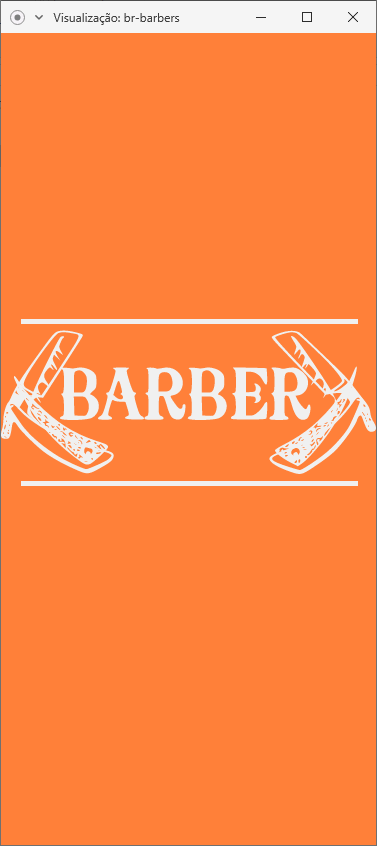

Esta é o frontend Mobile de um projeto criado durante os módulos 8, 9 e 10 no Bootcamp da Rocketseat. Nele desenvolvi um serviço apelidado de BrBarber onde os usuários podem se cadastrar como prestador de serviços através da [aplicação web](https://github.com/Douglasproglima/br-barbers-web) feita em ReactJS, e outros usuários podem agendar horários com estes prestadores através deste aplicativo, desenvolvido em React-native, sendo toda a lógica gerenciada pela [api](https://github.com/Douglasproglima/br-barbers-api) desenvolvida em NodeJS.

## Tecnologias utilizadas

- [axios](https://github.com/axios/axios)
- [date-fns](https://github.com/date-fns/date-fns)
- [immer](https://github.com/immerjs/immer)
- [prop-types](https://github.com/facebook/prop-types)
- [react](https://github.com/facebook/react)
- [react-native](https://github.com/facebook/react-native)
- [react-native-gesture-handler](https://github.com/kmagiera/react-native-gesture-handler)
- [react-native-linear-gradient](https://github.com/react-native-community/react-native-linear-gradient)
- [react-native-vector-icons](https://github.com/oblador/react-native-vector-icons)
- [react-navigation](https://github.com/react-navigation/react-navigation)
- [react-redux](https://github.com/reduxjs/react-redux)
- [reactotron-react-native](https://github.com/infinitered/reactotron-react-native)
- [reactotron-redux](https://github.com/infinitered/reactotron-redux)
- [reactotron-redux-saga](https://github.com/infinitered/reactotron-redux-saga)
- [redux](https://github.com/reduxjs/redux)
- [redux-persist](https://github.com/rt2zz/redux-persist)
- [redux-saga](https://github.com/redux-saga/redux-saga)
- [styled-components](https://github.com/styled-components/styled-components)

## Como usar

Pré-requisitos:

- Yarn/Npm
- [Back-end](https://github.com/Douglasproglima/br-barbers-api) da aplicação rodando

Acesse a pasta br-barbarber-api e siga os passos abaixos:

Para instalar as dependências rode o comando:
* yarn

Criar e subir um banco de dados Postgres pelo docker

* docker run --name brbarber-db -e POSTGRES_PASSWORD=docker -p 5432:5432 -d postgres:11

* docker start brbarber-db

No terminal e dentro da pasta backend rode o comando:
* yarn sequelize db:migrate para criar as tabelas no bando de dados

Criar e subir um banco de dados Redis pelo docker

* docker run --name redis-barber -p 6379:6379 -d -t redis:alpine

* docker start redis-barber

Criar e subir um banco de dados MongoDB pelo docker

*docker run --name mongo-barber -p 27017:27017 -d -t mongo

*docker start mongo-barber

Acesse o banco postgres com um gerenciador como, no meu caso usei o Postbird e após isso,  crie o banco com nome de brbarber

Siga o arquivo .env.example para setar as configurações

Para startar o servidor, rode o comando:
* yarn dev

Tendo isso, startamos o aplicativo

> react-native start

E carregamos no emulador do android

> react-native run-android

Ou, no emulador do iphone

> react-native run-ios

## Funcionalidades

- Autenticação
- Visualização dos agendamentos
- Realizar agendamento
- Cancelar agendamento
- Editar dados do perfil

## Apresentação Completa da versão Web/Mobile
----

### Versão Web

  <h2>Tela de Login</h2>
  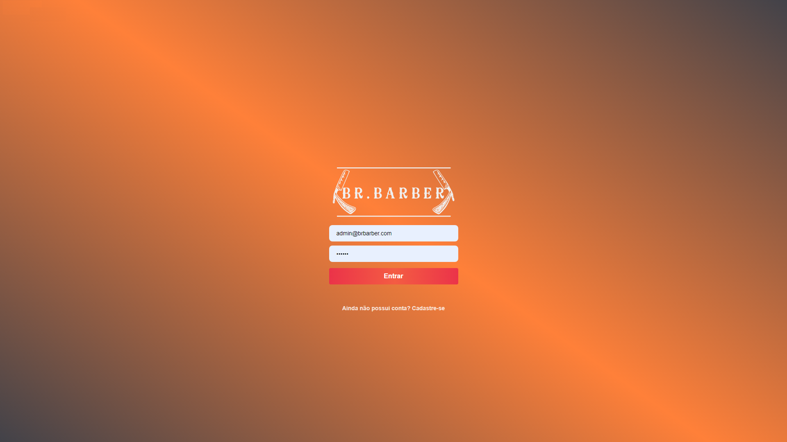

    
  <h2>Tela de Cadastro</h2>
  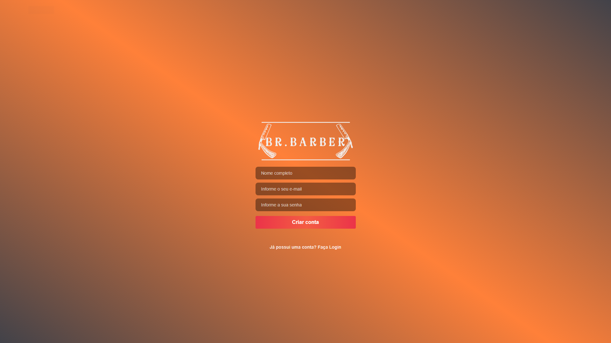

    
  <h2>Listagem dos Agendados do Dia - Thema Dark</h2>
  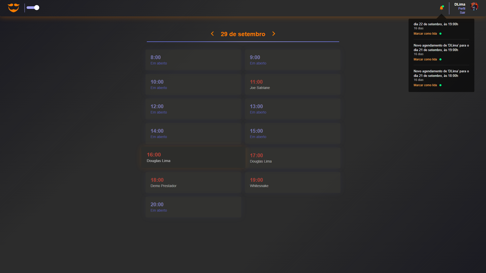

    
  <h2>Listagem dos Agendados do Dia - Thema Light</h2>
  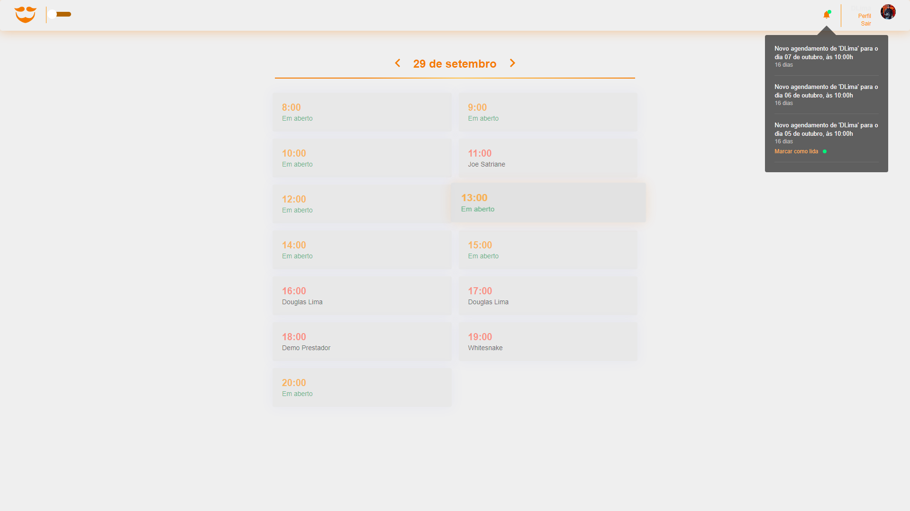

    
  <h2>Perfil do Usuário - Thema Light</h2>
  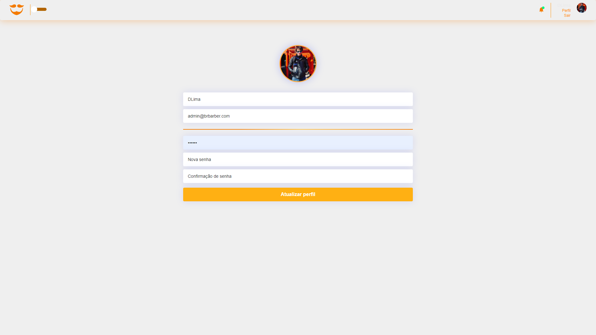

    
  <h2>Perfil do Usuário - Thema Dark</h2>
  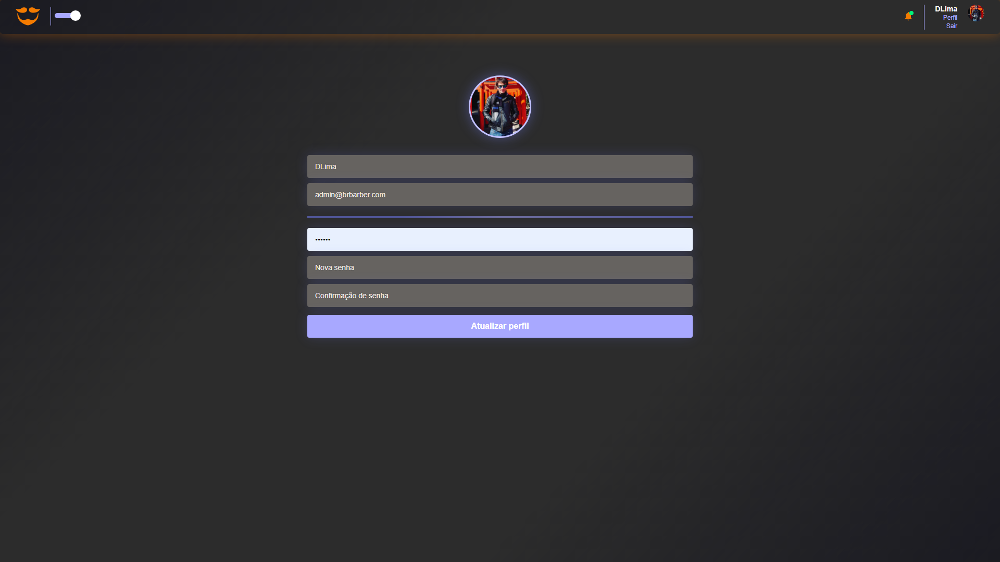

---

### Versão Mobile

  <h2>Apresentação</h2>
  

    
  <h2>Tela de Login</h2>
  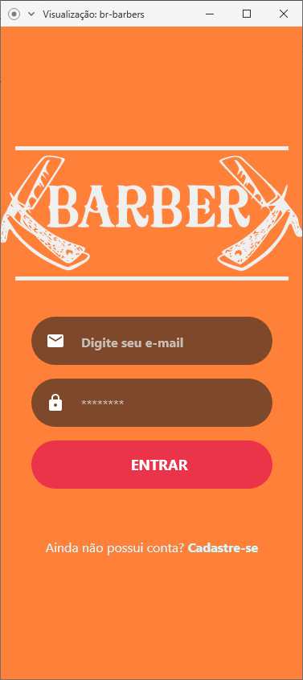

    
  <h2>Tela de Cadastro</h2>
  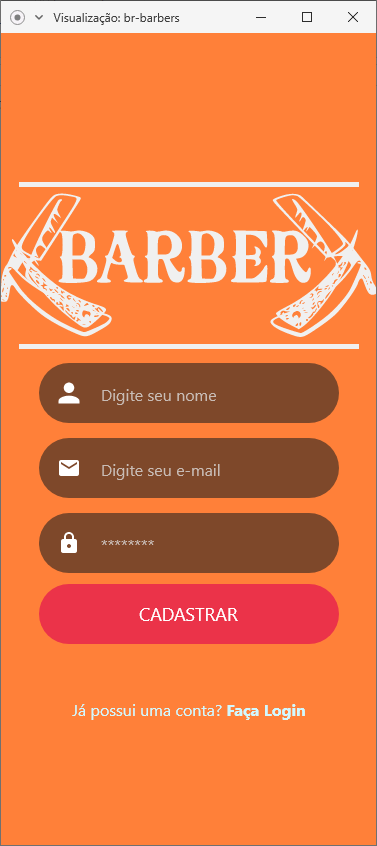

    
  <h2>Listagem dos barbeiros</h2>
  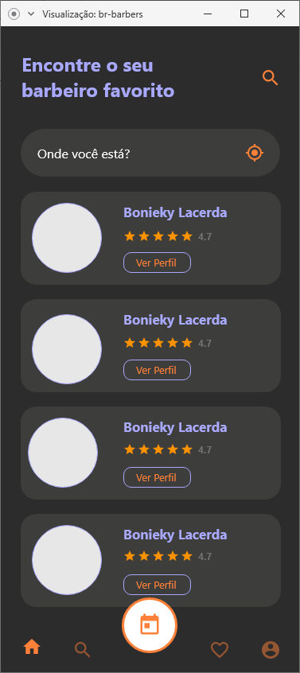

    
  <h2>Perfil do Barbeiro e Serviços Oferecidos</h2>
  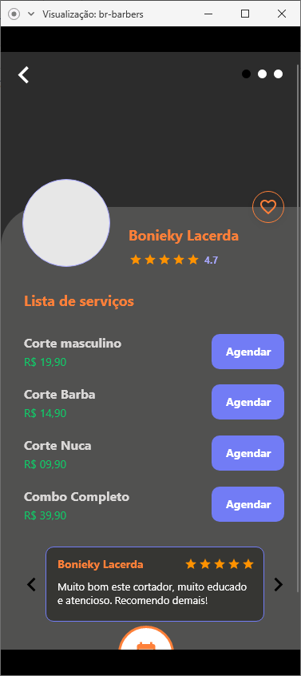

    
  <h2>Agendamento</h2>
  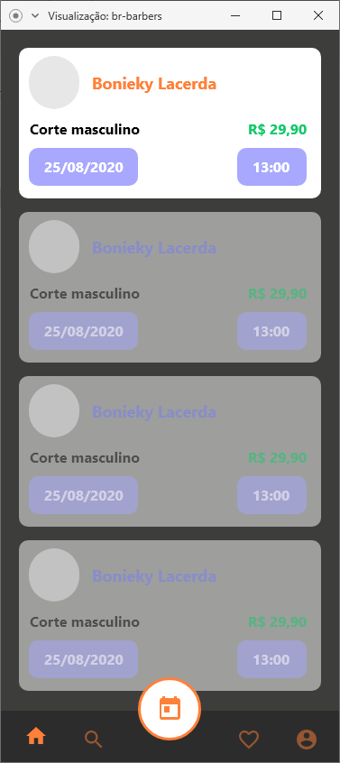

    
  <h2>Meus Favoritos</h2>
  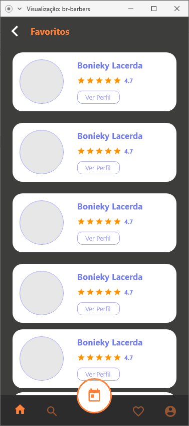

    
  <h2>Perfil do Usuário</h2>
  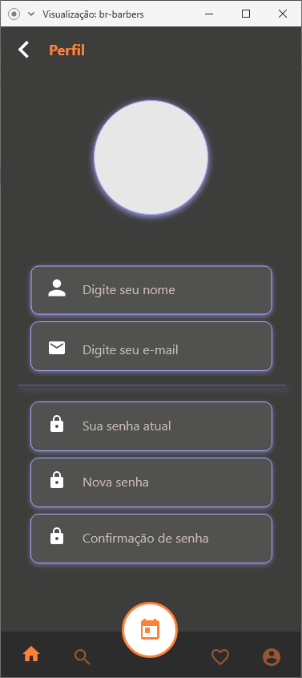

### :memo: Licença

Este projeto é desenvolvido sob a licença MIT. Veja o arquivo [LICENSE](LICENSE.md) para saber mais detalhes.

Feito com :purple_heart: by <strong> Douglas Lima</strong> 

